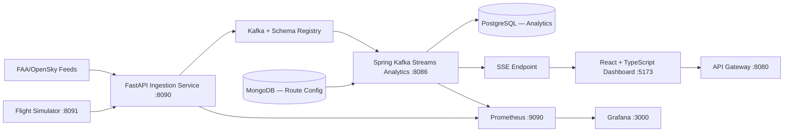

# AeroStream — Real-Time Airline Operations Intelligence Platform

> A production-style, event-driven distributed systems platform that ingests flight events, analyzes delay propagation in near-real time, and publishes route reliability metrics to live dashboards.

[](https://www.java.com/)
[](https://www.python.org/)
[](https://spring.io/projects/spring-boot)
[](https://kafka.apache.org/)
[](https://www.docker.com/)
[](https://github.com/manojpasunoori/AeroStream/actions)

---

## Overview

AeroStream simulates the operational backend of a real-world airline intelligence system. It covers the full data lifecycle — from flight event ingestion through streaming analytics and live dashboard visualization — using modern distributed systems patterns.

**Core capabilities:**
- Real-time flight event ingestion via FastAPI with Avro schema validation
- Schema-governed Kafka event streaming with Schema Registry
- Windowed delay propagation analytics via Spring Kafka Streams
- Route reliability scoring persisted to PostgreSQL
- Live dashboard updates via Server-Sent Events (SSE)
- Production-grade observability with Prometheus, Grafana, and OpenTelemetry
- API Gateway with API key auth, correlation ID tracing, and routing

---

## System Architecture



### Event Flow

```
1. Flight events produced by FAA/OpenSky connectors or the simulator
2. Ingestion service validates and publishes Avro events → topic: flight.events.v1
3. Kafka Streams computes 5-minute windowed route delay aggregations
4. Reliability scores persisted to PostgreSQL + pushed via SSE to dashboard
5. React dashboard renders live route metrics
6. Prometheus & Grafana expose operational health and SLO-level metrics
```

---

## Repository Structure

```
AeroStream/
├── gateway/                        # Spring Cloud Gateway — routing, auth, correlation IDs
├── services/
│   ├── flight-service/             # Spring Boot — flight registration & lookup (MySQL)
│   ├── crew-service/               # Spring Boot — crew assignments per flight (MySQL)
│   ├── delay-service/              # Spring Boot — delay tracking & categorization (MySQL)
│   ├── kpi-service/                # Spring Boot — KPI metrics & operational snapshot (MySQL)
│   ├── ingestion-service/          # FastAPI — Kafka producer, Avro validation, OpenSky connector
│   ├── flight-simulator/           # FastAPI — synthetic delay scenario generator
│   └── streaming-analytics/        # Spring Boot — Kafka Streams windowed analytics
├── dashboard/                      # React + TypeScript — live route metrics via SSE
├── schemas/
│   └── flight_event.avsc           # Avro schema contract for flight.events.v1
├── infra/
│   ├── mysql/                      # Init SQL scripts
│   ├── observability/              # Prometheus config, Grafana provisioning
│   ├── k8s/                        # Kubernetes manifests (namespace, deployments, ingress)
│   └── helm/                       # Helm chart + Kustomize overlays + ArgoCD app
├── load-test/
│   └── jmeter/                     # JMeter test plan for throughput testing
├── docs/
│   ├── local-development.md
│   ├── kafka-contracts.md
│   ├── streaming-analytics.md
│   ├── observability.md
│   ├── kubernetes-deployment.md
│   └── realtime-dashboard.md
├── demo/
│   ├── scripts/run_demo.sh
│   ├── scripts/run_demo.ps1
│   └── datasets/sample_flights.jsonl
├── .github/workflows/              # CI: test → build → image scan → publish
├── docker-compose.yml
└── .env.example
```

---

## Local Setup

### Prerequisites

- Docker & Docker Compose
- Java 17+ (for local service development)
- Python 3.11+ (for ingestion/simulator development)
- Node.js 18+ (for dashboard development)

### 1. Clone & Configure

```bash
git clone https://github.com/manojpasunoori/AeroStream.git
cd AeroStream
cp .env.example .env
# Edit .env and set your API key and passwords
```

### 2. Start the Full Stack

```bash
docker compose up -d --build
```

### 3. Verify Services

| Service               | URL                              |
|-----------------------|----------------------------------|
| API Gateway           | http://localhost:8080            |
| Ingestion Service     | http://localhost:8090/docs       |
| Flight Simulator      | http://localhost:8091/docs       |
| Streaming Analytics   | http://localhost:8086/actuator   |
| React Dashboard       | http://localhost:5173            |
| Prometheus            | http://localhost:9090            |
| Grafana               | http://localhost:3000 (admin/admin) |
| Kafka UI (optional)   | http://localhost:8085            |

---

## 🔌 API Reference

### API Gateway

All external traffic routes through the gateway. Include the API key header on every request:

```bash
curl -H "X-API-KEY: <your_api_key>" http://localhost:8080/api/flights
```

### Domain Services (via Gateway)

| Service        | Port | Swagger UI                               |
|----------------|------|------------------------------------------|
| flight-service | 8081 | http://localhost:8081/swagger-ui/index.html |
| crew-service   | 8082 | http://localhost:8082/swagger-ui/index.html |
| delay-service  | 8083 | http://localhost:8083/swagger-ui/index.html |
| kpi-service    | 8084 | http://localhost:8084/swagger-ui/index.html |

### Operational KPI Snapshot

```bash
curl -H "X-API-KEY: <your_api_key>" \
  "http://localhost:8080/api/kpis/operational-snapshot?onTimeThresholdMinutes=15"
```

> `onTimeThresholdMinutes` must be between `0` and `300`. Default: `15`.

### Route Reliability (Streaming Analytics)

```bash
# Live SSE stream — connect to receive real-time route updates
curl -H "Accept: text/event-stream" http://localhost:8086/api/routes/stream

# Latest reliability scores snapshot
curl http://localhost:8086/api/routes/reliability
```

---

## Real-Time Data Flow

### Start the Flight Simulator

```bash
# Normal operations
curl -X POST http://localhost:8091/simulate/start

# Storm scenario — generates cascading delays for demo
curl -X POST http://localhost:8091/simulate/scenario/storm

# Stop simulation
curl -X POST http://localhost:8091/simulate/stop
```

### Kafka Topic

Events are published to `flight.events.v1` as Avro messages governed by `schemas/flight_event.avsc`.

```json
{
  "flightId": "AA101",
  "origin": "DFW",
  "destination": "LAX",
  "scheduledDeparture": "2024-03-10T14:00:00Z",
  "actualDeparture": "2024-03-10T14:23:00Z",
  "delayMinutes": 23,
  "delayCategory": "WEATHER",
  "status": "DELAYED"
}
```

---

## Observability

### Health Checks

```bash
curl http://localhost:8081/actuator/health
curl http://localhost:8086/actuator/health
```

### Prometheus Metrics

```bash
curl http://localhost:8081/actuator/prometheus
```

### Grafana Dashboards

Navigate to http://localhost:3000 (admin/admin). Pre-provisioned dashboards include:
- **Route Reliability** — real-time delay propagation by route
- **Service Health** — JVM metrics, request rates, error rates
- **Kafka Throughput** — consumer lag, topic message rates

### Correlation ID Tracing

Every request entering the gateway is assigned a `X-Correlation-ID` header, propagated across all services, and included in structured logs:

```
INFO [cid=3b21d8f2-a1b2-...] [service=flight-service] Flight AA101 created successfully
INFO [cid=3b21d8f2-a1b2-...] [service=delay-service]  Delay recorded: 23 min, category=WEATHER
```

---

## Security

- API key enforced at gateway layer via `X-API-KEY` header
- Unauthorized requests return `401 Unauthorized`
- API key configured via `.env` (never committed)
- Services are not exposed on host network — only reachable through the gateway

---

## Load Testing

JMeter test plan located at `load-test/jmeter/`. Simulates concurrent API calls and validates system throughput under load.

```bash
# Run via JMeter CLI
jmeter -n -t load-test/jmeter/aerostream-test.jmx -l results.jtl
```

---

## Kubernetes Deployment

Manifests are in `infra/k8s/`. Helm chart with environment-specific overlays is in `infra/helm/`.

```bash
# Apply K8s manifests directly
kubectl apply -f infra/k8s/

# Or deploy via Helm
helm upgrade --install aerostream infra/helm/aerostream \
  -f infra/helm/values-dev.yaml
```

ArgoCD app definition: `infra/helm/argocd-app.yaml`

---

## Demo

### 2-Minute Demo Script

```bash
# bash
./demo/scripts/run_demo.sh

# PowerShell
./demo/scripts/run_demo.ps1
```

**Manual walkthrough:**
1. `docker compose up -d --build`
2. Open dashboard at http://localhost:5173
3. Start the storm scenario: `curl -X POST http://localhost:8091/simulate/scenario/storm`
4. Watch live route reliability scores update on the dashboard
5. Open Grafana at http://localhost:3000 — observe delay spikes and Kafka throughput
6. Call the reliability API: `curl http://localhost:8086/api/routes/reliability`

Full walkthrough: `docs/demo-walkthrough.md`  
Sample dataset: `demo/datasets/sample_flights.jsonl`

---

## Engineering Decisions

| Decision | Rationale |
|---|---|
| **Kafka + Avro schemas** | Decouples producers/consumers; enforces schema evolution discipline |
| **Spring Kafka Streams** | Deterministic, stateful windowed aggregations with minimal ops overhead |
| **SSE over WebSockets** | Low-overhead unidirectional push — no broker complexity for dashboard updates |
| **PostgreSQL for analytics, MongoDB for config** | Workload-optimized data stores; avoid one-size-fits-all storage |
| **API Gateway for auth + correlation IDs** | Centralizes cross-cutting concerns; services stay focused on domain logic |
| **OTel + Prometheus** | First-class observability for production debugging and SLO tracking |
| **Helm + ArgoCD** | Repeatable, auditable environment promotion across dev/staging/prod |

---

## 📚 Documentation

| Doc | Description |
|---|---|
| [local-development.md](docs/local-development.md) | Full local setup, troubleshooting, and development workflow |
| [kafka-contracts.md](docs/kafka-contracts.md) | Avro schema, topic naming, and consumer group conventions |
| [streaming-analytics.md](docs/streaming-analytics.md) | Kafka Streams topology, windowing logic, reliability scoring algorithm |
| [observability.md](docs/observability.md) | Prometheus metrics catalog, Grafana dashboard guide, log format spec |
| [kubernetes-deployment.md](docs/kubernetes-deployment.md) | K8s and Helm deployment guide |
| [realtime-dashboard.md](docs/realtime-dashboard.md) | Dashboard architecture, SSE integration, component guide |

---

## Tech Stack

| Layer | Technology |
|---|---|
| Domain Services | Java 17, Spring Boot 3.2.x, Spring Data JPA, Spring Cloud Gateway |
| Streaming | Apache Kafka 3.x, Confluent Schema Registry, Spring Kafka Streams |
| Ingestion / Simulation | Python 3.11, FastAPI, confluent-kafka, fastavro |
| Dashboard | React 18, TypeScript, Vite |
| Databases | MySQL 8 (domain), PostgreSQL 15 (analytics), MongoDB 7 (config) |
| Observability | Prometheus, Grafana, Micrometer, OpenTelemetry Collector |
| Infrastructure | Docker Compose, Kubernetes, Helm, Kustomize, ArgoCD |
| CI/CD | GitHub Actions (test → build → image scan → publish) |
| API Docs | Springdoc OpenAPI / Swagger UI |
| Load Testing | Apache JMeter |

---

## 👤 Author

**Manoj Pasunoori**  
MS Information Systems — University of Texas at Arlington  
Backend & Distributed Systems Engineer

[](https://linkedin.com/in/manojpasunoori)
[](https://github.com/manojpasunoori)
