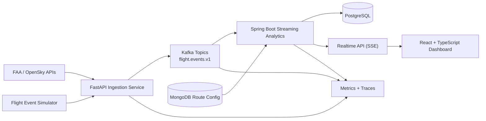

# AeroStream: Real-Time Airline Operations Intelligence Platform

AeroStream is an event-driven airline operations platform designed for production-grade distributed systems interviews. It ingests live or simulated flight updates, detects delay propagation, and exposes operational intelligence through APIs, streaming analytics, and a real-time dashboard.

## System Goals

- Ingest high-volume flight telemetry with low-latency pipelines.
- Model delay propagation across routes and hubs.
- Serve operational insights to planners in real time.
- Operate with production observability, reliability, and deployment workflows.

## Architecture Overview

## Core Components

- `services/ingestion-service` (FastAPI): receives upstream events and publishes to Kafka.
- `services/flight-simulator` (Python): generates synthetic operations scenarios.
- `services/streaming-analytics` (Spring Boot): consumes events, computes route reliability and delay propagation.
- `dashboard` (React + TypeScript): real-time operational dashboard via SSE.
- `infra/observability`: Prometheus, Grafana dashboards, OpenTelemetry collector.
- `infra/helm` + `infra/k8s`: Kubernetes deployment assets.

## Event Flow

1. Flight updates arrive from FAA/OpenSky connectors or simulator.
2. Ingestion service validates and publishes Avro events to Kafka.
3. Streaming analytics consumes events and performs windowed aggregations.
4. Aggregated KPIs are persisted to PostgreSQL.
5. Route and airport operational configuration is read from MongoDB.
6. Dashboard receives push updates through SSE and renders live metrics.

## Data Stores

- PostgreSQL: derived analytics, route reliability, and historical aggregates.
- MongoDB: route metadata, scenario configuration, and policy settings.

## Non-Functional Priorities

- Idempotent event processing and safe retries.
- Partition-aware consumer scaling.
- End-to-end tracing and service-level metrics.
- CI/CD with build, test, security scan, and deploy gates.
- GitOps deployment model with environment promotion.

## Repository Layout

- `gateway`: API gateway and edge concerns.
- `services`: microservices (ingestion, simulator, analytics, domain services).
- `infra`: compose, observability, Kubernetes, Helm, ArgoCD manifests.
- `load-test`: performance validation assets.
- `.github/workflows`: CI/CD pipelines.

## Quick Start (Local)

1. Copy environment template:
   - `cp .env.example .env`
2. Start core stack:
   - `docker compose up -d --build`
3. Verify services:
   - Gateway: `http://localhost:8080`
   - Prometheus: `http://localhost:9090`
   - Grafana: `http://localhost:3000`

## Engineering Decisions

- Kafka as the event backbone to decouple ingestion, simulation, and analytics.
- Avro + Schema Registry to enforce event contracts and support evolution.
- Spring Boot for JVM streaming workloads and ecosystem maturity.
- FastAPI for rapid ingestion development and Python ecosystem integration.
- SSE for low-overhead dashboard push updates.

## Status

This repository is being upgraded in progressive production-style commits:

- Local developer platform
- Kafka contract maturity
- Synthetic simulation workflows
- Realtime dashboard updates
- Observability and tracing
- CI/CD hardening
- Kubernetes + GitOps rollout
- Demo readiness
